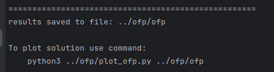
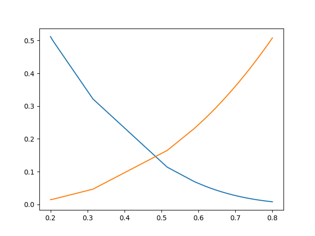
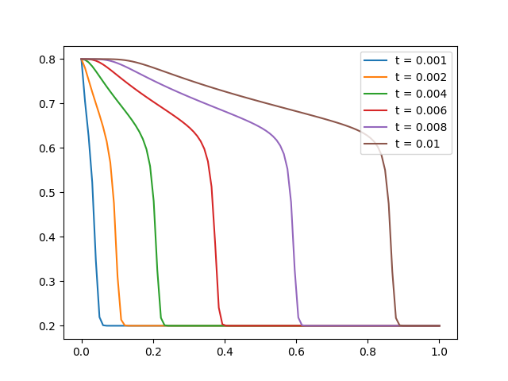
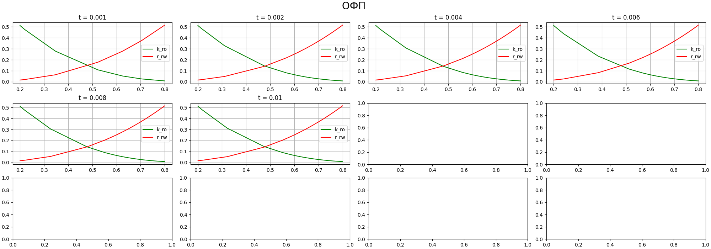

# Buckley-Leverett equation solver for two-phase filtration (oil-water)
___________________

# Install

```bash
git clone git@github.com:artiebears13/Buckley-Leverett.git
```

```bash
cd Buckley-Leverett/BL_cpp
```

```bash
mkdir build
cd build
```
```bash
cmake ..
make
```

```bash
./BL_cpp
```

or to run dynamic solution use

```bash
./Dynamic
```
________________
- Parameters: [BL_cpp/source/params.h](BL_cpp/source/params.h)
- Initial params: [BL_cpp/main.cpp](BL_cpp/main.cpp)

---------------

# Example of solution

Program generates file ```ofp``` and you can plot (follow instruction) after running 
```./BL_cpp``` 
:


**example of result**:

______________________
# Example of dynamic solution

program generates file 
```
../results/res_DD-MM-YYYY_HH-MM-SS
```
where after initial params goes solution:

```angular2html
x sw(x) so(x) ko(sw) kw(sw) pc(sw)
```

in file [BLproblem.cpp](BL_cpp/source/BLproblem.cpp)
you can change functions

 - ```double BLproblem::k_rw(double &sw)``` (line 5) 
 - ```double BLproblem::k_ro(double &sw)``` (line 10)
 -  ```double BLproblem::pc(double &sw)```  (line 14)

For default data:

### Saturation:



## $$K_{rw}(sw)$$ and $$k_{ro}(sw)$$




